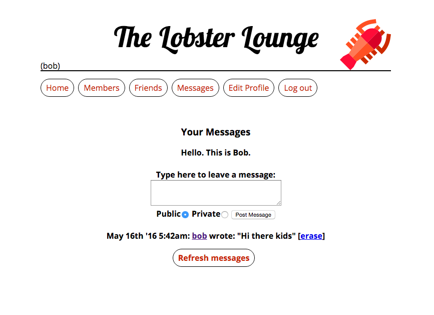

# The Lobster Lounge 

A light-weight social site in efforts to learn some php over the weekend. Users can signup/login; post bios and messages; or follow and manage friends. 

## See it for yourself

Clone the repo into XAMPP and run setup.php first to set up database tables. Don't forget to give permissions to $dbuser in functions.php. Lastly, start up the db and server in XAMPP and go to localhost/demo-social-site/index.php to see the home page.

## To-Do List (Improvements to make)

Since the goal was to do this in a weekend, I only created the bare-bones of a social site. Some ideas to improve the site in the near future:

* Find an efficient way to display many, many members on the site
* Add a status section
* Deploy on Heroku
* Add more security layers and salt them hash strings
